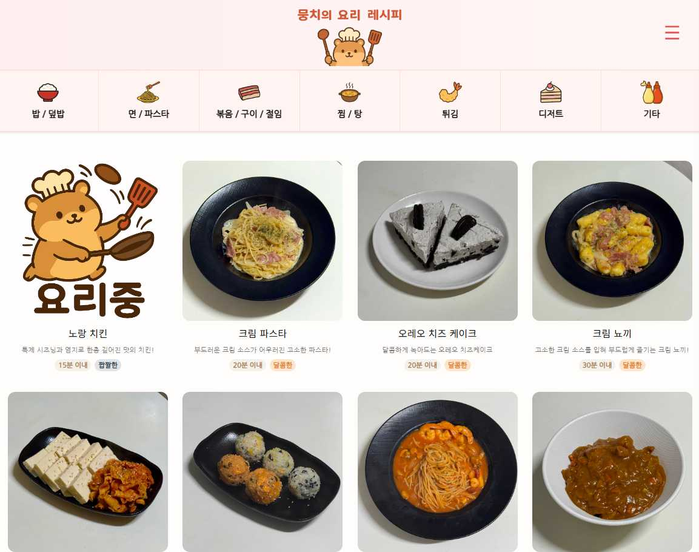
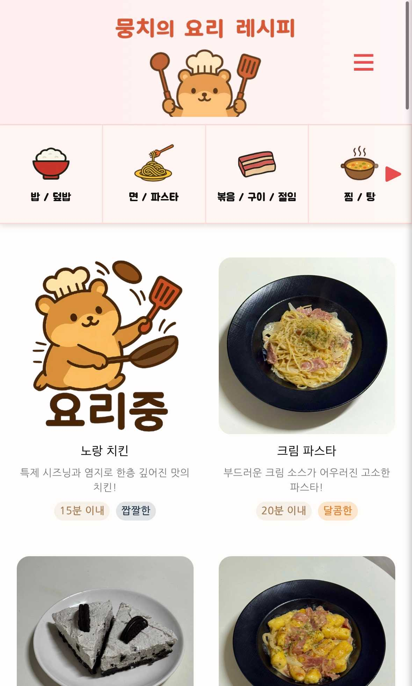

# 뭉치의 요리 레시피 🍳

## 프로젝트 목적
이 웹앱은 **내가 만든 요리를 기록하고, 레시피를 기억하지 못할 때 다시 찾아볼 수 있도록** 개발되었습니다.  
- 내가 만든 요리 기록  
- 원하는 재료나 요리명 검색으로 빠른 레시피 확인  
- 최근 본 레시피 자동 저장 및 관리  
- 요리 카테고리별 손쉬운 탐색  

## 🖼️ 미리보기

### 💻 데스크탑 화면

### 📱 모바일 화면

## 🧩 기능

1. **검색 기능**  
   - 재료, 요리명, 카테고리 기반 검색 가능  
   - 검색 후 화면 맨 위로 자동 스크롤

2. **최근 본 레시피 기록**  
   - 최대 10개 저장  
   - 사이드바에서 바로 확인 가능  

3. **카테고리별 탐색**  
   - 밥 / 덮밥, 면 / 파스타, 볶음 / 구이 / 절임 등  
   - 버튼 클릭으로 카테고리 검색  

4. **반응형 디자인**  
   - 모바일과 PC 모두 지원  
   - 스크롤 애니메이션 및 사이드바 토글 제공

5. **편리한 네비게이션**  
   - 좌우 화살표로 카테고리 이동  
   - 스크롤 시 "맨 위로" 버튼 표시  

---

## ⚙️ 사용 기술

- HTML5 / CSS3 / JavaScript
- LocalStorage (최근 본 레시피 저장)

